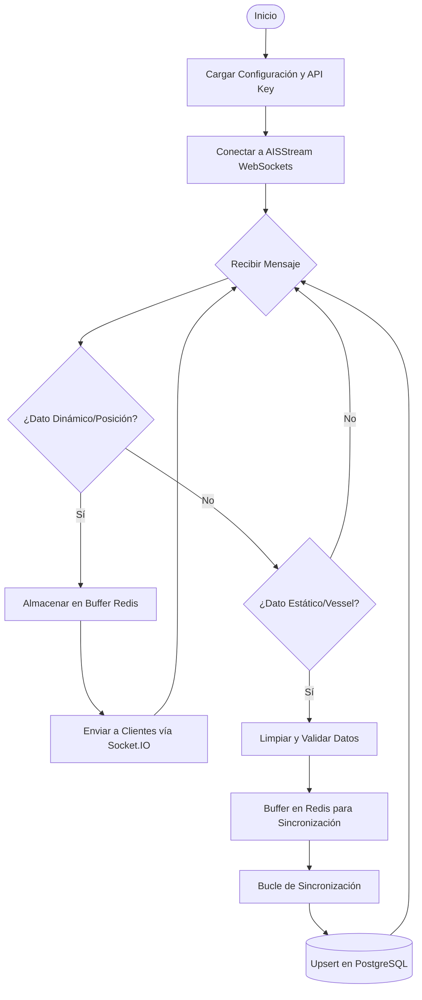
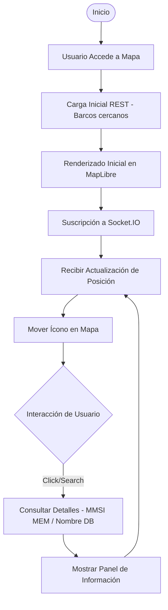
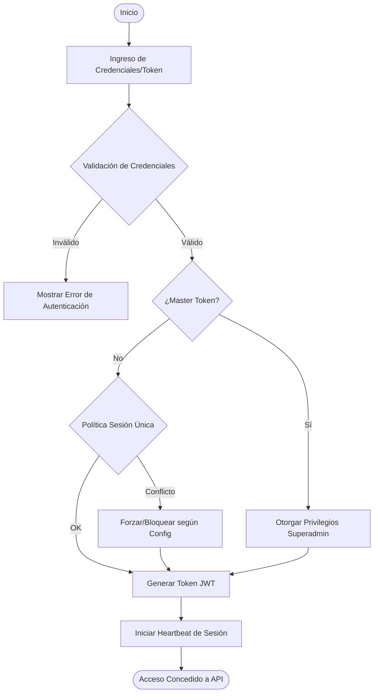
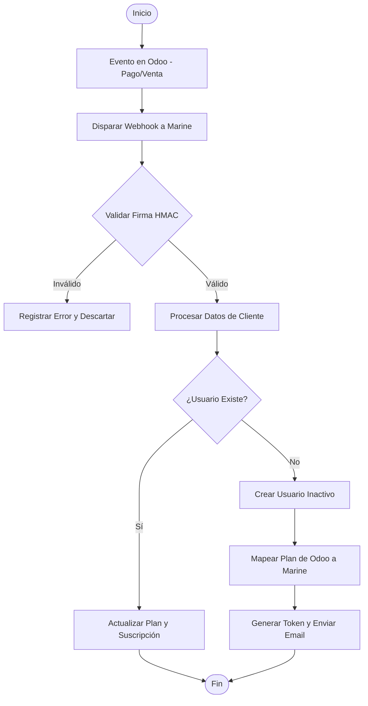
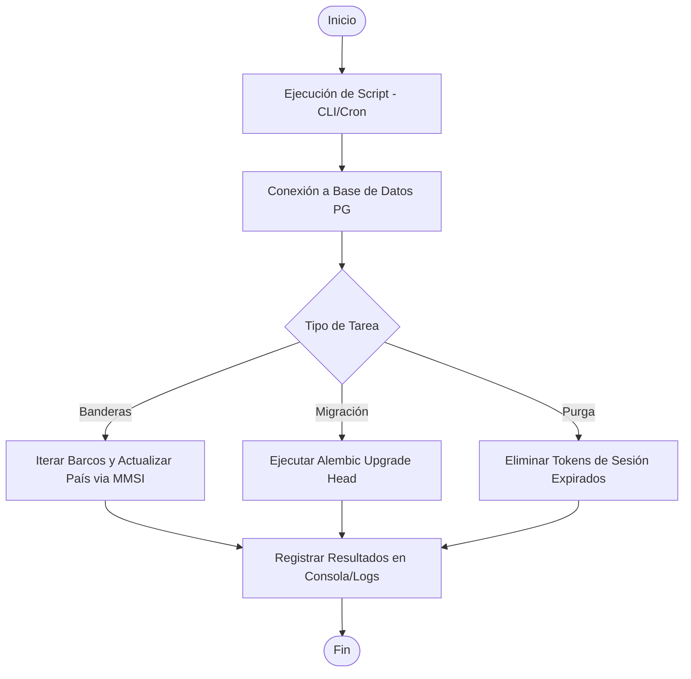

# Diagramas de Flujo - HSOMarine (Mermaid)

Este documento contiene el código Mermaid para visualizar cada uno de los procesos del sistema.

## 1. Ingesta de Datos AIS

## 2. Visualización y API

## 3. Autenticación y Sesiones

## 4. Integración Odoo

## 5. Tareas de Mantenimiento

